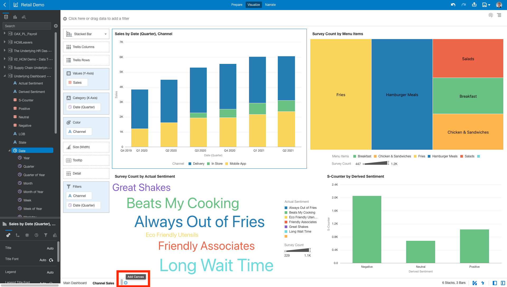

#Channel Sales

## Introduction

This lab walks you through the steps to better understand sales performance through visualizations that blend data from ERP, CX, and POS.

Estimated Time: 30 minutes

### Objectives

Today, we will be utilizing Oracle Analytics Server ability to pull cross-functional data together from across your entire business and to report on it in a single place, leveraging data sets and best practice KPIs. You can also extend the data model using any external data sources when utilizing governed, self-service, and augmented capabilities to run analysis. For the purpose of this lab, we will be highlighting its self-service capabilities by creating some visualizations.

In this lab, you will:
* Create a Stacked Bar Chart
* Create a Treemap
* Create Bar Chart
* Create Tag Cloud
* Analyze Sentiment

### Prerequisites

This lab assumes you have:
* An Oracle account
* All previous labs successfully completed
* Access to a data visualization instance

  > **Note:** If you have a **Free Trial** account, when your Free Trial expires your account will be converted to an **Always Free** account. You will not be able to conduct Free Tier workshops unless the Always Free environment is available. **[Click here for the Free Tier FAQ page.](https://www.oracle.com/cloud/free/faq.html)**

## **Task 1:** Create Stacked Bar Chart

1. To begin you will select the plus symbol to open an empty canvas so that we can build out this project. So, let’s get right into it!

    

2. First, let’s see how sales are split across the different channels within the "Underlying DashBoard Data - 1."

    

    * **Control Select** "Sales by Channel" and then navigate to "Quarter" within Date

    

    * **Right Click** and Select "Stacked Bar Chart."

3. Now we can see the sales broken down by each individual channel for the past couple of quarters. In Store and Delivery seem to be the biggest contributors to sales, but we need to investigate these values further.

    

4. Let's filter out the years that are not relevant to the visual by dragging Date(Quarter) to the filter tab and **select** quarters in 2020 - 2021.

    

  Now we have the correct stacked bar chart of sales by channel!

## **Task 2:** Create a Treemap

1. On the same dashboard, let's continue visualizing the dataset by inspecting survey data that was collected.

    

    * **Control Select** "Menu Items by Survey Count," the same way we did previously.
    * **Right Click** and Select "Treemap."
    * Make sure to also drag "Menu Items" to color in order to color code the top responses.

2. Now we have a visual that breaks down the different surveys we collect by menu items. We can see that our top 5 menu categories, where fries and hamburger meals top the list - not surprising as this QSR is known for their fries.

    

## **Task 3:** Create a Bar Chart

1. From these survey responses, let's continue by analyzing the different kinds of sentiment that was derived.

    

    * This time we will **Control Select** "Derived Sentiment by S-Counter,"
    * **Select** Create Best Visualization.
    * This will autonomously create a Bar Chart for us based on the metrics selected.
    * Also make sure to filter out any nulls in this visual and the next if you have them.

2. Now we have a visual that breaks down the different instances of each sentiment.

    

## **Task 4:** Create a Tag Cloud

1.  Let's finish up by creating a tag cloud to summarize the leading responses to each customer sentiment.

    

    * **Control Select** "Survey Count by Actual Sentiment."
    * **Select** "Tag Cloud."

    * Make sure to also drag "Derived Sentiment" to color in order to color code by sentiment.

    

    * In order to also have accurate representations of color sentiment we can **Select** "Manage Assignments."

    

    * Then we can change the colors to red for "Negative," yellow for "Neutral," and blue for "Positive."

    

2. Now we have a visual that breaks down the top responses of customer surveys such as "Always Out of Fries, Long Wait Time, and Beats My Cooking" by sentiment.

    

## **Task 5:** Analyze Sentiment

1. Let's wrap up this dashboard with a quick encompassing filter that can help us interact with the different sentiments.

    * **Select** the hamburger menu at the top right of the bar chart in the bottom left corner.
    * **Select** "Use as Filter."

    

2. Next we can **Select** "Negative" bar to bring up only negative sentiment results from the dashboard. This shows all the relevant information within the dashboard that has a negative sentiment, revealing the key responses for it - "Long Wait Time and Always Out of Fries."

    

3. In summary, Customer survey responses are displayed in the bottom two visualizations within the dashboard. The detail on the left showing the leading indicators of customer sentiment from the 1100 survey responses in the last week - fortunately, as we see on the right, the majority are positive or neutral, but there are also a large amount of negative responses mostly around long wait times and being out of fries, not good. But, glad to see people prefer our cooking over their own in our retail stores!

    

4. Now that we have completed our Channel Sales Dashboard, we can name it "Channel Sales." You may now **proceed to the next lab.**

## Acknowledgements

* **Authors** - Killian Lynch, Nagwang Gyamtso, Luke Wheless, Akash Dharamshi, Solution Engineer Specialist Hub Team, NA Technology
* **Contributors** - Luke Wheless, Solution Engineer Specialist Hub Team, NA Technology
* **Last Updated By/Date** - Luke Wheless, Solution Engineer Specialist Hub Team, NA Technology, March 2022
