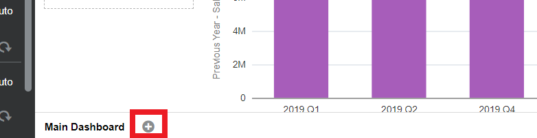

## Introduction

*This lab walks you through the Steps to better understand sales performance through visualizations that blend data from ERP, CX, and POS.*

Estimated Time: 20 minutes

### Objectives

Today, we will be utilizing Oracle Analytics Server ability to pull cross-functional data together from across your entire business and to report on it in a single place, leveraging data sets and best practice KPIs. You can also extend the data model using any external data sources when utilizing governed, self-service, and augmented capabilities to run analysis. For the purpose of this lab, we will be highlighting its self-service capabilities by creating some visualizations.

In this lab, you will:
* Create a Stacked Bar Chart
* Create a Treemap
* Create Tag Cloud
* Create Bar Chart
* Analyze Sentiment

### Prerequisites

This lab assumes you have:
* An Oracle account
* All previous labs successfully completed
* Access to a data visualization instance

  > **Note:** If you have a **Free Trial** account, when your Free Trial expires your account will be converted to an **Always Free** account. You will not be able to conduct Free Tier workshops unless the Always Free environment is available. **[Click here for the Free Tier FAQ page.](https://www.oracle.com/cloud/free/faq.html)**

## Task 1: Create Stacked Bar Chart

1. Let’s start by adding a new canvas. Click on the "+" icon at the bottom to create a new canvas. Let’s start visualizing!

    

2. First, let’s see how sales are split across the different channels within the "Underlying Dashboard Data 1."

    

    * **Control select** "Sales – Channel by Quarter."
    * **Select** Stacked Bar Chart

3. Now we can see the sales broken down by each individual channel for the past couple of quarters. In Store and Delivery seem to be the biggest contributors to sales, but we need to investigate this further.

    

4. Let's filter out the years that are not relevant to the visual by dragging Date(Quarter) to the filter tab and select quarters in 2020 - 2021.

    

  Now we have the correct stacked bar chart of sales by channel!

## Task 2: Create a Treemap

1. On the same dashboard, let's continue visualizing the dataset by inspecting the survey data that was collected on sales.

    

    * **Control select** "Menu Items by Survey Count," the same way we did previously and make sure Menu Items is under color.
    * **Select** Treemap.
    * Make sure to also drag Menu Items to color in order to color code the top responses.

2. Now we have a visual that breaks down the different surveys we collect by menu items. We can see that our top 5 menu categories, where fries and hamburger meals top the list - not surprising as this QSR is known for their fries.

    

## Task 3: Create a Tag Cloud

1. From these survey responses, let's continue by inspecting the leading indicators of customer sentiment.

      

      * **Control select** "Survey Count by Actual Sentiment," the same way we did previously
      * **Select** Tag Cloud.
      * Make sure to also drag Actual Sentiment to color in order to color code the top responses.

2. Now we have a visual that breaks down the top leading indicators of customer sentiment.

      

## Task 4: Create a Bar Chart

  1. Let's finish up by creating a simple bar chart to summarize our sentiment analysis.

      

      * This time we will **control select** "Derived Sentiment by S-Counter," and select pick visualization.
      * This will autonomously **select** a Bar Chart for us based on the metrics selected.

  2. Now we have a visual that breaks down the different instances of each sentiment.

      

## Task 5: Analyze Sentiment

  Customer survey responses are displayed on the bottom in two visualizations. The detail on the left showing the leading indicators of customer sentiment from the 1100 survey responses in the last week - fortunately, as we see on the right, the majority are positive or neutral, but there are negative responses mostly around long wait times and being out of fries, not good.  But, glad to see people prefer our cooking over their own.

  

  Now that we have completed our Channel Sales Dashboard, we name it "Channel Sales" and jump to the next section!
