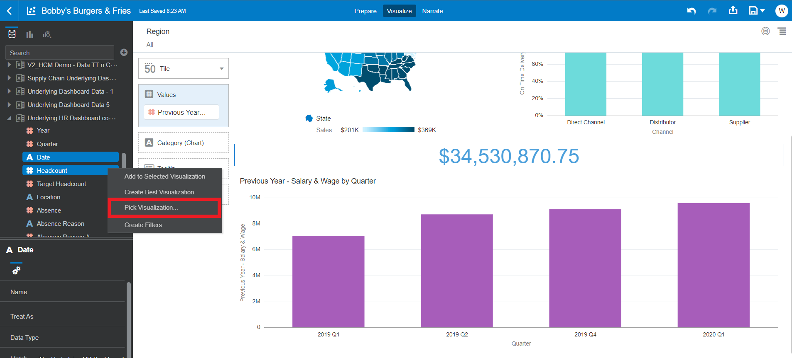

# Self-Service Data Visualization for Retail

## Introduction
This exercise will introduce you to the key features of data visualization within Oracle Analytics Server and will help to tell a story on what is happening at **Bobby's Burgers & Fries**, a fictional quick serve restaurant with chains in multiple geographies.

*Estimated Completion Time:* 20 minutes

### About Oracle Analytics Server
Oracle Analytics Server features powerful, intuitive data visualization capabilities that enable analysts to create self-service data visualizations on an accurate and consistent data set.

### Objectives

In this lab, you will explore best practice key performance indicators (KPIs) to drive actionable insights into Bobby's Burgers & Fries.

QSR chains are facing issues with customers and their changing preferences, managing multi-channel sales, operations and retaining top line staff while driving sales growth. Having the ability to do cross pillar data analysis with non-oracle data provides the ability to perform a deeper dive to identify root causes.

In this scenario we will monitor business performance through the creation of dashboards and canvases to quickly find insights:
* Net Sales and On Time Delivery Percentage
    - “Net Sales growing but under target. On Time Delivery performance lagging in Distribution Centers”
* Deeper insights through the analysis of dashboards with the ability to analyze:
    - Sales Analysis  – “Being out of fries could be hurting sales”
    - OTD Analysis – “The Pennsylvania Distribution Center appears to be driving the shortage of fries, hampering sales in the Northeast region.”
    - Headcount Analysis – “Long Wait Times is an indicator that there might be turnover that is affecting payroll costs and customer satisfaction.”
* Connected insights enables collaboration across functions enables you to share data insights.

### Prerequisites
This lab assumes you have:
- A Free Tier, Paid or LiveLabs Oracle Cloud account
- You have completed:
    - Lab: Prepare Setup (*Free-tier* and *Paid Tenants* only)
    - Lab: Environment Setup
    - Lab: Initialize Environment

The following files <if type="external">referenced in [Lab: Initialize Environment](?lab=init-start-oas) should already be downloaded and staged as instructed, as they</if> <if type="desktop"> staged under *`/opt/oracle/stage`*</if> are required to complete this lab.
- *** use the dva here ***

## Task 1: Explore Data
1. From the browser session you started in [Lab: Initialize Environment](?lab=init-start-oas), Click on the *"Page Menu"* icon identified by the  symbol located in the upper right-hand corner.

    

2. **Click** on Import Project/Flow... to upload the file used in the .

3. **Select** the "Select File" and pick the .dva file you downloaded earlier.

4. **Click** Import. The dva will be imported to your OAS home page.

5. **Select** the Bobby's Burgers & Fries icon from under the Projects section.  

6. You will be presented with an empty canvas. Let’s start visualizing! First, **click** on the Prepare tab at the top of the screen. Here is where we can see all of the data that Bobby's Burgers & Fries will be working with.
    
Oracle Analytics Server includes its own light weight data preparation capabilities. When you import the spreadsheet, you will navigate to the preparation tab before adding the data to the project.  Here you can make some modifications to the data elements or make modifications to your data based upon any recommendations Oracle Analytics knowledge service suggests.  Additionally, you can define a relationship between the subject areas in order to join the data sources for further analysis.

7. **Select** the data diagram tab from the bottom of the screen to visualize the relationship between the data sets. You can view all the relationships as well as navigate through the different data sets to get an understanding of what we will be working with.
    
8. Once satisfied with the above step, proceed back to the Visualize tab at the top of the screen. **Click** Visualize.

## Task 2: Discover Insights
The data visualization capabilities in Oracle Analytics Server are extensive, include things like mapping and custom calculations. In this exercise we will use both capabilities: we will create custom calculations based on two available metrics, and we will then display the results on a map.

1. In this first exercise we will create our first visual. Lets view sales by location. Using the visualizations menu on the left side of the pane,
    - **Control select** "State in 'region1' folder" and "Sales in 'region1' folder".
    - **Right click**, select "Pick Visualization".

    

2. **Select** "Map".

    

3. Observe the map on the canvas. You can see the sales by region across the US.

    

Right away we can see that the north east region sales is severely behind the rest of the country. We will dig deeper and find out why that is in the next lab. For now lets continue to build out our main dashboard.

5. Next we want to create individual 'cards' for the different KPIs we are going to be measuring. **Click** and **drag** "regions1 - Sales" measure above the map visual you just created. A dark blue line appears.  It identifies the location of your visualization. You may drop the visualization to the left, right, top or bottom. In our case we will drop the visual on top of the one we just created.
    
    

6. Now we are going to create our second card. Open the Supply Chain Underlying Dashboard Data and
    - **Control select** "Supply Chain Underlying Dashboard Data - On Time Delivery" and "Supply Chain Underlying Dashboard Data - Channel".
    - **Right click**, select "Pick Visualization"

    

7. **Select** "Stacked Bar".

    

Here we are gaining an understanding of our on time delivery percentage by channel. Notice our Direct Channel is more than 10% worse than our Supplier and Distributor's on time delivery percentage.

9. **Click** and **drag** "Supply Chain Underlying Dashboard Data -Channel" into our filter.

    

10. **Select** Direct Channel, Distributor, and Supplier so your filer matches the one image below. Click into the On Time Delivery by Channel visualization to save and close the filter box.

    

11. To create our "Card", **Click** and drag Supply Chain Underlying Dashboard Data - On Time Delivery" so that the blue bar appears above the new visual. *"NOTE: Sometimes the tool can be touchy. I find dragging and dropping the visual into a different location first, and then dragging into smaller areas, lets you move things more freely"*

    
    
Select "Save" in the top right of the screen to save and update your project.

12. In this exercise we will create a custom calculations and two more custom visuals to create our HR analysis cards in order analyze salary and the relationship to company headcount.

13. **Right Click** on the "My Calculations" folder.  **Select** "Add Calculation".

    

14. Now we will create a new metric called "Previous Year - Salary & Wage". Notice there are a wide range of functions available for creating custom calculations using the expression builder. We are going to use the code snippet below. Feel free explore the expression builder and create the calculation that way. In the box below the name of our new calculation, copy and paste the following. *"NOTE: The arguments in our calculation appear as full path names but are shortened when added into the calculation box of OAS. If confused use the picture below to make sure your custom calculation matches."*

        <copy>(FILTER(XSA('weblogic'.'Financial (1)')."Columns"."Previous Year - Operating Expenses" USING XSA('weblogic'.'Financial (1)')."Columns"."Account Group"='Salary & Wage'))</copy>

    

15. **Click** Validate. **Click** Save.
You have successfully created your own custom calculation that can be used like any other metric.

    

16. Let’s utilize our custom calculation in a couple of visualizations. Locate the 'My Calculations' and 'OAX PL Payroll' folders on the right side of the project.
    - **Control select** 'My Calculations - Previous Year - Salary & Wage' and 'OAX PL Payroll' - Quarter'
    - **Right click**, select "Create Best Visualization"

    

17. Next, **Click** and **drag** 'My Calculations - Previous Year - Salary & Wage' above new visual.

    

18. Within the properties box (in the bottom right of the screen) select the Values '#' tab and we are going to change the number format to currency.

    

19. For our last card we are going to analyze Headcount by Quarter to compare with our Salary & Wage by Quarter analysis.
    - **Control select** 'Underlying HR Dashboard copy - Date' and 'Underlying HR Dashboard copy - Headcount'
    - **Right click**, select "Pick Visual" and select "Line"

    
    

20. Now we want to filter by 'Underlying HR Dashboard copy - Date'. We want to analyze the same quarter we used in the Salary & Wage by Quarter card. **Drag** and **drop** 'Underlying HR Dashboard copy - Date' into the filter. **Select** 2019Q1, 2019Q2, 2019Q4, and 2020Q1. Notice the drop in the number of employees between 2019Q4 and 2020Q1. We will dig into this in the proceeding labs.
    

21. Now, **Drag** and **drop** the visual we just created by the 'Previous Year - Salary & Wage by Quarter' visual.

    

22. To finish the 'Headcount by Date' card. **Drag** and **drop** the 'Underlying HR Dashboard copy - Headcount' Measure above the visual we just created. Select "Save" to save and update your project.

    
    

You have now finished the Main Dashboard creation. Next we will take a closer look at our sales. Proceed to the next Lab.

## Learn More
* [Oracle Analytics Server Documentation](https://docs.oracle.com/en/middleware/bi/analytics-server/index.html)
* [https://www.oracle.com/business-analytics/analytics-server.html](https://www.oracle.com/business-analytics/analytics-server.html)
* [https://www.oracle.com/business-analytics](https://www.oracle.com/business-analytics)

## Acknowledgements
* **Authors** - Killian Lynch, Nagwang Gyamtso, Luke Wheless, Akash Dharamshi, Solution Engineer Specialist Hub Team, NA Technology
* **Contributors** - Killian Lynch, Solution Engineer Specialist Hub Team, NA Technology
* **Last Updated By/Date** - Killian Lynch, Solution Engineer Specialist Hub Team, NA Technology, February 2022
